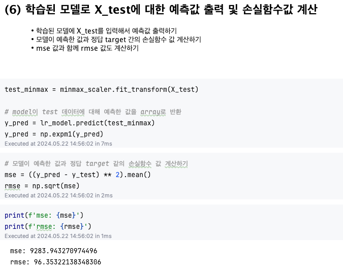
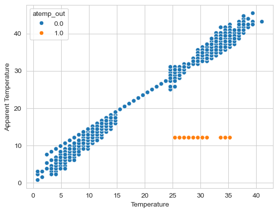
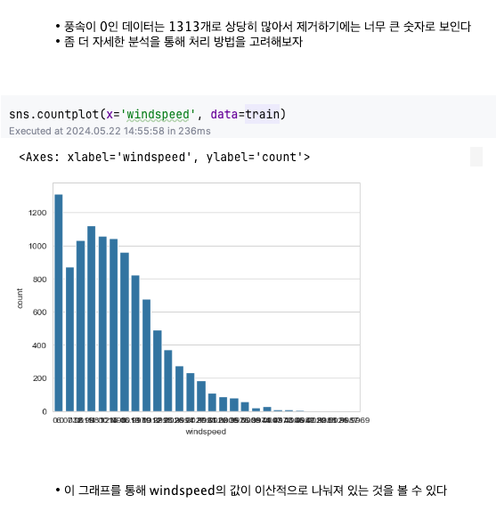
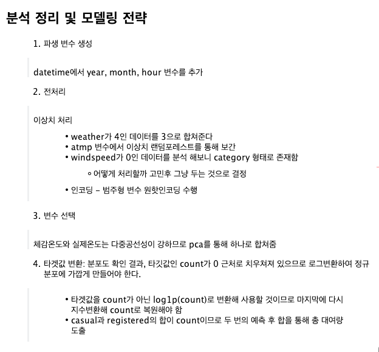

# AIFFEL Campus Online Code Peer Review Templete
- 코더 : 김성연
- 리뷰어 : 김형민


# PRT(Peer Review Template)
- [o]  **1. 주어진 문제를 해결하는 완성된 코드가 제출되었나요?**
    - 문제에서 요구하는 최종 결과물이 첨부되었는지 확인
    - 문제를 해결하는 완성된 코드란 프로젝트 루브릭 3개 중 2개, 
    퀘스트 문제 요구조건 등을 지칭
        - 해당 조건을 만족하는 코드를 캡쳐해 근거로 첨부
            
            


    
- [o]  **2. 전체 코드에서 가장 핵심적이거나 가장 복잡하고 이해하기 어려운 부분에 작성된 
주석 또는 doc string을 보고 해당 코드가 잘 이해되었나요?**
    - 해당 코드 블럭에 doc string/annotation이 달려 있는지 확인
    - 해당 코드가 무슨 기능을 하는지, 왜 그렇게 짜여진건지, 작동 메커니즘이 뭔지 기술.
    - 주석을 보고 코드 이해가 잘 되었는지 확인
        - 잘 작성되었다고 생각되는 부분을 캡쳐해 근거로 첨부합니다.


        
- [o]  **3. 에러가 난 부분을 디버깅하여 문제를 “해결한 기록을 남겼거나” 
”새로운 시도 또는 추가 실험을 수행”해봤나요?**
    - 문제 원인 및 해결 과정을 잘 기록하였는지 확인
    - 문제에서 요구하는 조건에 더해 추가적으로 수행한 나만의 시도, 
    실험이 기록되어 있는지 확인
        - 잘 작성되었다고 생각되는 부분을 캡쳐해 근거로 첨부합니다.
          - 랜덤포레스트 모델을 활용하여 결측치를 보간하고 이상한 데이터에 대한 탐색을 하였습니다.

    ```python
    from sklearn.ensemble import RandomForestRegressor
    # atemp_out이 1인 데이터의 인덱스를 추출
    index_outlier = train[train['atemp_out'] == 1].index
    
    # atemp_out이 0인 데이터를 학습 데이터로 사용
    X_train = train[train['atemp_out'] == 0][['temp', 'humidity', 'windspeed','month','hour']]
    y_train = train[train['atemp_out'] == 0]['atemp']
    
    # 랜덤 포레스트 모델 생성
    model = RandomForestRegressor()
    
    # 모델 학습
    model.fit(X_train, y_train)
    
    # atemp_out이 1인 데이터의 온도, 습도, 풍속을 사용하여 체감온도 예측
    y_pred = model.predict(train[train['atemp_out'] == 1][['temp', 'humidity', 'windspeed','month','hour']])
    
    # 예측한 체감온도를 train 데이터에 업데이트
    train.loc[index_outlier, 'atemp'] = y_pred
    ```
- 풍속 데이터가 이상해서 데이터를 직접 눈으로 다양한 방식으로 확인 해 본 부분이 있었다.

        
- [o]  **4. 회고를 잘 작성했나요?**
    - 주어진 문제를 해결하는 완성된 코드 내지 프로젝트 결과물에 대해
    배운점과 아쉬운점, 느낀점 등이 기록되어 있는지 확인
    - 전체 코드 실행 플로우를 그래프로 그려서 이해를 돕고 있는지 확인
        - 잘 작성되었다고 생각되는 부분을 캡쳐해 근거로 첨부합니다.

  - 시간이 부족해서 조금 더 자세하지 못했던 게 아쉽다
- [o]  **5. 코드가 간결하고 효율적인가요?**
    - 파이썬 스타일 가이드 (PEP8) 를 준수하였는지 확인
    - 하드코딩을 하지않고 함수화, 모듈화가 가능한 부분은 함수를 만들거나 클래스로 짰는지
    - 코드 중복을 최소화하고 범용적으로 사용할 수 있도록 함수화했는지
        - 잘 작성되었다고 생각되는 부분을 캡쳐해 근거로 첨부합니다.
        - datetime 컬럼을 바꾸는 코드를 효율적으로 작성했습니다
```python
# datetime 컬럼을 datetime 자료형으로 변환
train['datetime'] = pd.to_datetime(train['datetime'])

# 추출할 시간 관련 속성들
time_attrs = ['year', 'month', 'day', 'hour', 'minute', 'second']

# for 루프를 사용하여 각 속성을 추출하고 저장
for attr in time_attrs:
    train[attr] = getattr(train['datetime'].dt, attr)
```

# 참고 링크 및 코드 개선
```
# 코드 리뷰 시 참고한 링크가 있다면 링크와 간략한 설명을 첨부합니다.
# 코드 리뷰를 통해 개선한 코드가 있다면 코드와 간략한 설명을 첨부합니다.
```
