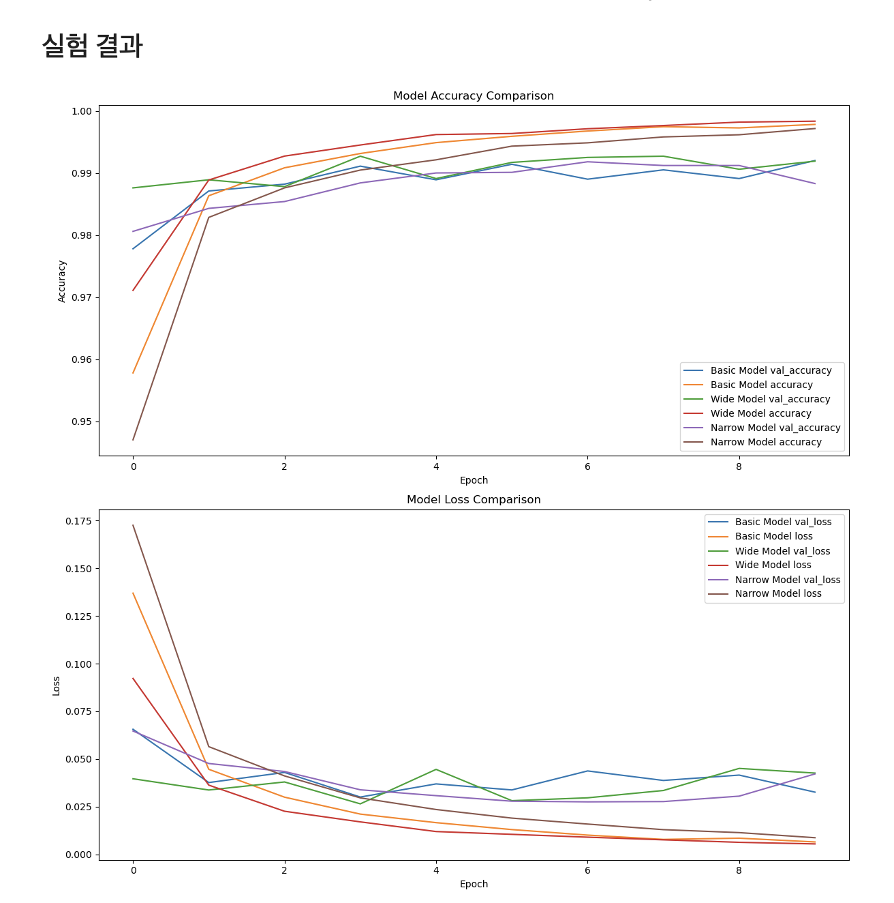
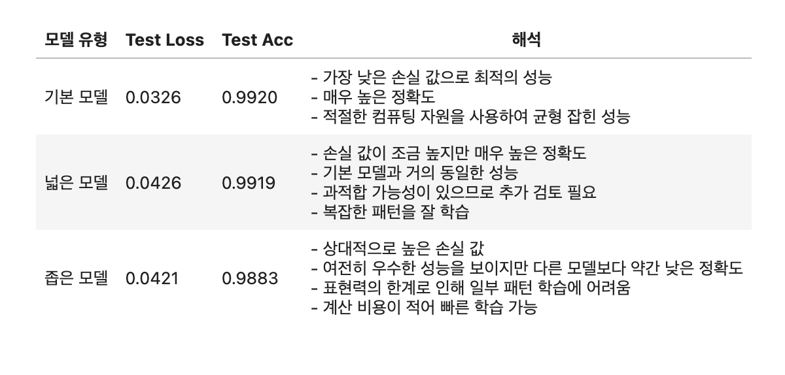

🔑 **PRT(Peer Review Template)**

- [x]  **1. 주어진 문제를 해결하는 완성된 코드가 제출되었나요? (완성도)**
    - 문제에서 요구하는 최종 결과물이 첨부되었는지 확인
    - 문제를 해결하는 완성된 코드란 프로젝트 루브릭 3개 중 2개, 
    퀘스트 문제 요구조건 등을 지칭
        - 해당 조건을 만족하는 부분의 코드 및 결과물을 캡쳐하여 사진으로 첨부
            ```python
                # 학습률이 변화하는 모델
                class CustomModel(keras.Model):
                    ...

                    # 학습률 스케줄링 함수 정의
                    def schedule_lr(step):
                        initial_lr = 0.001
                        decay_steps = 1000
                        decay_rate = 0.1
                        lr = initial_lr * (decay_rate ** (step // decay_steps))
                        return lr

                # 모델 인스턴스화
                model = get_mnist_model()
                custom_model = CustomModel(inputs=model.input, outputs=model.output)
            ```

- [x]  **2. 프로젝트에서 핵심적인 부분에 대한 설명이 주석(닥스트링) 및 마크다운 형태로 잘 기록되어있나요? (설명)**
    - 전반적으로 간결한 주석으로 가독성이 좋았습니다.
    - [x]  모델 선정 이유
        - 실험을 위한 베이스 모델을 잘 구현해주셨습니다.
    - [x]  Metrics 선정 이유
        - Task에 적절한 평가 지표를 사용했습니다. 
    - [x]  Loss 선정 이유
        - 데이터셋에 맞는 `categorical_crossentropy`를 사용했습니다.

- [x]  **3. 체크리스트에 해당하는 항목들을 모두 수행하였나요? (문제 해결)**
    - [x]  데이터를 분할하여 프로젝트를 진행했나요? (train, validation, test 데이터로 구분)
    - [x]  하이퍼파라미터를 변경해가며 여러 시도를 했나요? (learning rate, dropout rate, unit, batch size, epoch 등)
    - [x]  각 실험을 시각화하여 비교하였나요?
        - 
    - [x]  모든 실험 결과가 기록되었나요?
        - 

- [x]  **4. 프로젝트에 대한 회고가 상세히 기록 되어 있나요? (회고, 정리)**
    - [x]  배운 점
    - [x]  아쉬운 점
    - [x]  느낀 점
    - [x]  어려웠던 점