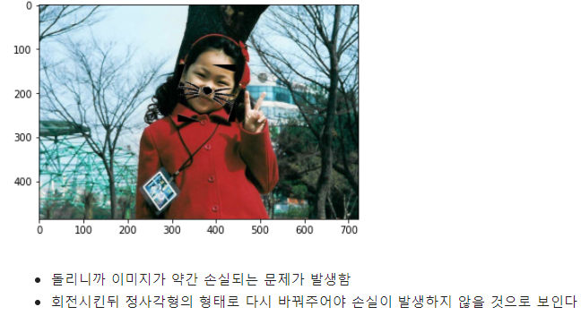
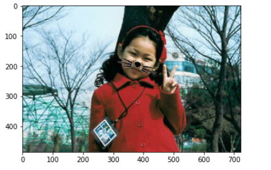

🔑 **PRT(Peer Review Template)**

-  **1. 주어진 문제를 해결하는 완성된 코드가 제출되었나요? (완성도)**
    - 문제에서 요구하는 최종 결과물이 첨부되었는지 확인
    - 문제를 해결하는 완성된 코드란 프로젝트 루브릭 3개 중 2개, 퀘스트 문제 요구조건 등을 지칭
    - 해당 조건을 만족하는 부분의 코드 및 결과물을 캡쳐하여 사진으로 첨부
          
        모두 다 잘 되어 있습니다.  
        
        얼굴이 돌아간 다른 사진에도 잘 붙어져 있습니다!! 
        그런데 더 재밌는 실험을 하셨는데 그건 3번에 기술하겠습니다. 

- **2. 프로젝트에서 핵심적인 부분에 대한 설명이 주석(닥스트링) 및 마크다운 형태로 잘 기록되어있나요? (설명)**
    -이번 프로젝트에는 적용할 수 있는 부분이 없어서 스킵하겠습니다. 

- **3. 체크리스트에 해당하는 항목들을 모두 수행하였나요? (문제 해결)**
    - 1번 얼굴이 돌아간 사진에서 코가 얼굴이랑 같이 돌아가지 않는 문제를 해결하기 위한 실험을 하셨는데 아주 흥미로웠습니다. 
    - 먼저 첫번째 실험 결과는 다음과 같습니다.
    
    
    코드를 보면 얼굴 양 옆쪽의 위치를 먼저 찍고, 그 차이값을 x,y 에 대해 각각 구한 뒤 np.arctan2, np.degrees, getRotationMatrix2D, warpAffine 함수를 사용해서 돌리려는 시도가 있었습니다. 
    그런데 얼굴을 보면 알 수 있다시피, 돌아간 수염 때문에 얼굴 윗부분의 이미지가 약간 손실되어서, 먼저 이 수염을 회전시키고 -> 정사각형으로 바꿔서 -> 적용하는 실험을 했습니다. 
    
    이렇게 다시 코드를 변환해서
     돌아간 얼굴에도 잘 맞춰서 스티커가 붙여집니다. 

-  **4. 프로젝트에 대한 회고가 상세히 기록 되어 있나요? (회고, 정리)**
    잘 기록되어 있습니다.

- 평가자 회고: 
  돌아간 얼굴에 스티커를 돌려서 붙일 때 생기는 이미지 소실을 해결하고자 한 점이 돋보입니다.
  저도 이 코드를 보면서 정사각형으로 바꾸지 않고 바로 스티커를 적용해버리면 이미지 일부가 소실될 수 있다는 것을 처음 배워 유익한 시간이었습니다!!!!