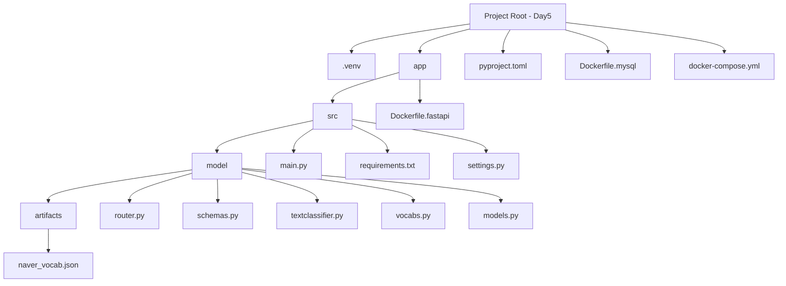

# 네이버 영화 감성 분석
- 모델 save -> load -> predict

```mermaid
graph TD
    A[Project Root - Day5]
    A --> B[.venv]
    A --> C[app]
    C --> D[src]
    D --> E[model]
    E --> F[artifacts]
    F --> G[naver_vocab.json]
    E --> H[router.py]
    E --> I[schemas.py]
    E --> J[textclassifier.py]
    E --> K[vocabs.py]
    E --> L[models.py]
    D --> M[main.py]
    D --> N[requirements.txt]
    D --> O[settings.py]
    C --> P[Dockerfile.fastapi]
    A --> Q[pyproject.toml]
    A --> R[Dockerfile.mysql]
    A --> S[docker-compose.yml]

```
