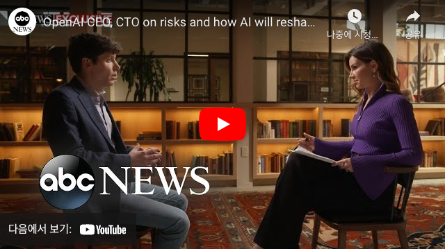
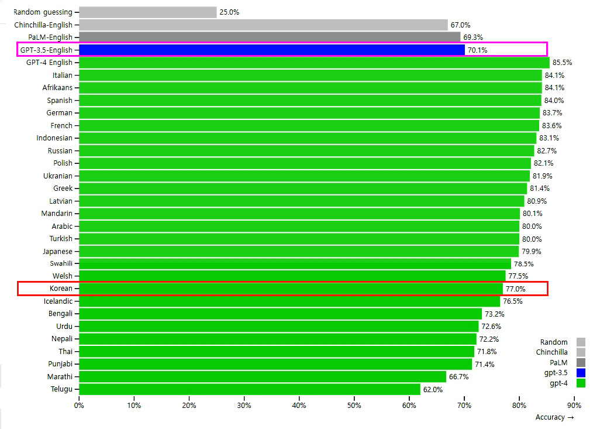
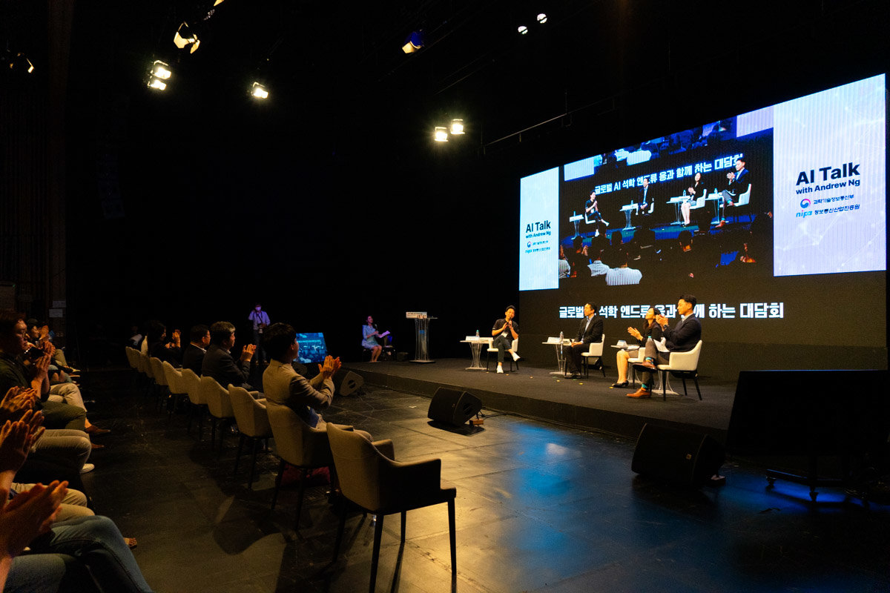
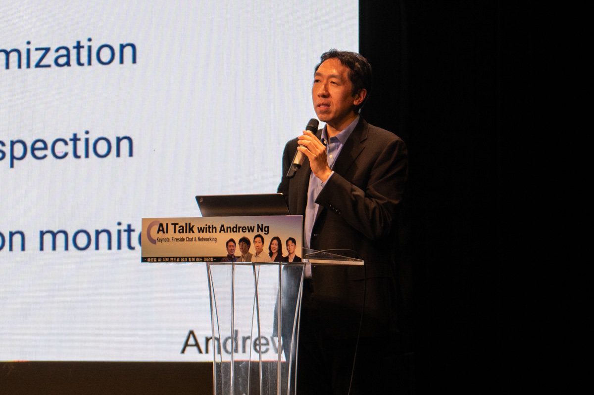
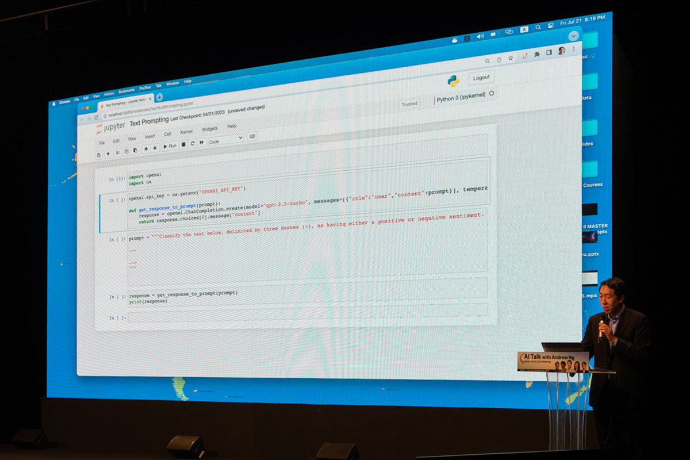
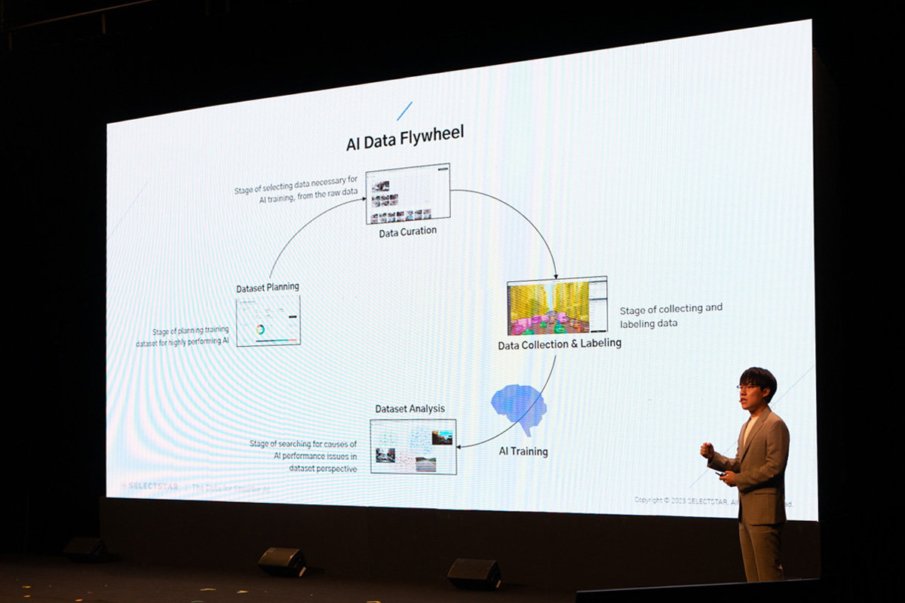
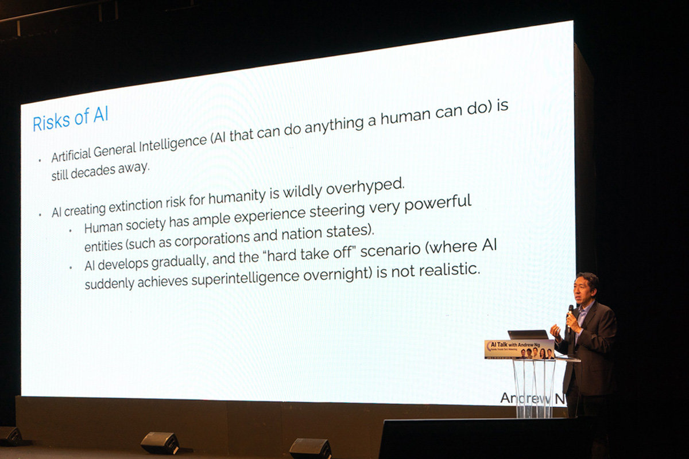
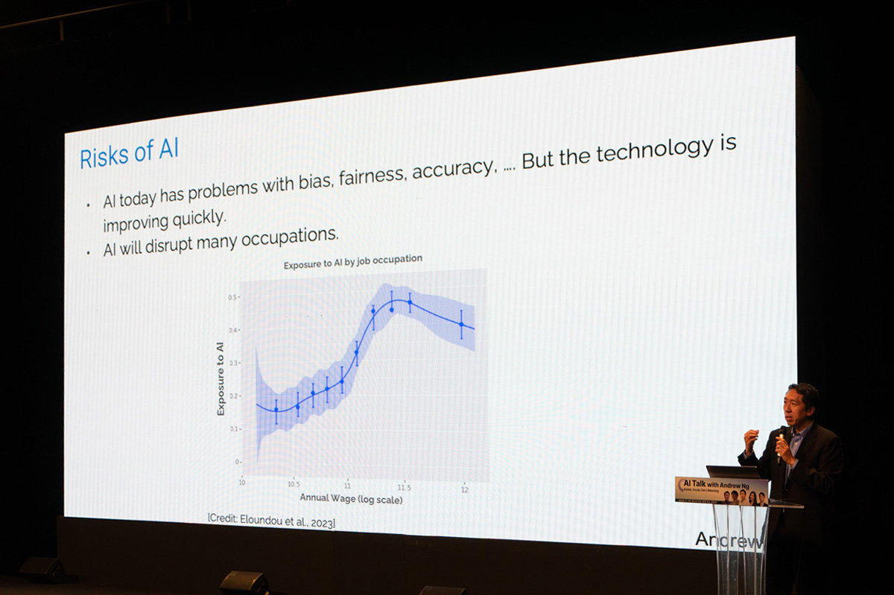

# 깃허브 실습

## 마크다운을 이용해서 뉴스와 회고 적기

다음은 마크 저커버그가 만든 AI 비서 자비스에 관한 뉴스와 샘 알트만의 GPT-4,
앤드류 응 교수에 관한 뉴스이다.

- [마크 저커버그가 직접 만들어 본 AI 비서 ‘자비스’](https://about.fb.com/ko/news/2016/12/%EB%A7%88%ED%81%AC-%EC%A0%80%EC%BB%A4%EB%B2%84%EA%B7%B8-ai-%EB%B9%84%EC%84%9C-%EC%9E%90%EB%B9%84%EC%8A%A4%EC%97%90-%EB%8C%80%ED%95%B4-%EC%9D%B4%EC%95%BC%EA%B8%B0%ED%95%98%EB%8B%A4/)

- [GPT-4 발표한 오픈AI '샘 알트만'](https://www.aitimes.kr/news/articleView.html?idxno=27595)

- [세계 4대 AI 석학 앤드류 응 교수, "인공지능 업계에 영원한 봄 왔다"](https://www.donga.com/news/It/article/all/20230725/120394744/1)

---

## 마크 저커버그가 직접 만들어 본 AI 비서 ‘자비스’
###### 2016년 12월 19일   
지난 1월, Facebook CEO 마크 저커버그(Mark Zuckerberg)가 <아이언맨>에 등장하는 ‘자비스’와 같은 AI 비서 개발에 도전하겠다는 개인적인 새해 목표를 밝힌 것을 기억하시나요?

저커버그가 1년간의 도전의 결과물인 자비스를 모두에게 소개했습니다.

먼저, 저커버그가 자신의 Facebook 프로필(https://www.facebook.com/zuck)에 업로드한 동영상으로 자비스를 만나 볼까요?

저커버그는 자비스 구축 과정에서 배우고 느낀 점을 글로 전하기도 했는데요, 아래에서 간략한 내용을 만나 보실 수 있습니다.

자비스는 어떻게 개발됐는지, 무엇을 할 수 있는지, 그리고 AI에 대해 저커버그는 어떤 생각을 하고 있는지 살펴 보세요. 원문은 해당 링크(https://www.facebook.com/notes/mark-zuckerberg/building-jarvis/10154361492931634)에서 확인하실 수 있습니다.

### ‘자비스(Jarvis)’ 구축하기

2016년 한 해 동안 저는 개인적인 프로젝트를 하나 진행했습니다. 바로 <아이언맨>에 등장하는 ‘자비스’처럼 집안일을 도와 주는 간단한 인공지능(AI)을 구축하는 일인데요.

프로젝트 기간 동안, AI의 놀라운 발전을 직접 경험하는 동시에 아직 갈 길이 멀다는 것 역시 깨달을 수 있었습니다.

‘자비스’는 스마트폰과 컴퓨터를 매개체로 사람의 말을 이해하고 조명∙온도∙가전∙음악∙보안 등 각종 집안 시설을 제어할 수 있습니다. 또한 자비스는 사람의 취향과 습관을 학습할 수 있으며 새로운 단어와 개념을 학습하고, 심지어 아이와 놀아줄 줄도 아는 똑똑한 AI입니다. 자비스 개발에는 자연어 처리, 음성 인식, 얼굴 인식, 강화 학습처럼 다양한 AI 기술과 파이썬, PHP, 오브젝티브-C 등 다양한 프로그래밍 언어가 사용됐습니다.

지금부터 여러분께 자비스를 소개합니다. 그리고 이 프로젝트를 진행하면서 제가 배우고 느낀 점에 대해 말씀드리겠습니다.

### 시작은 집안을 연결하는 것부터

집안에 있는 시스템을 서로 연결하는 것은 생각보다 복잡했습니다. 시스템들이 각기 다른 프로그래밍 언어와 프로토콜로 이뤄져 있었고, 대부분의 가전제품은 인터넷에 연결조차 돼 있지 않았기 때문입니다.

자비스와 같은 AI 도우미들이 미래에 보다 널리 사용되기 위해서는 더 많은 기기를 서로 연결할 수 있는 공통 API와 같은 표준이 필요하다는 것을 알 수 있었습니다.

### 자연어

다음 단계는 집안 시스템들이 사람의 말을 알아들을 수 있도록 하는 일이었습니다. 우선, 자비스와 사람이 문자로 소통할 수 있는 체계를 만들기로 했습니다. 그 다음, 사람의 목소리를 문자로 변환하고, 자비스가 저에게 하고 싶은 말을 소리로 전달할 수 있는 능력을 추가했습니다.

처음에는 ‘침실’, ‘전등’, ‘스위치 켜줘’와 같은 기본적인 키워드로 시작했습니다. 이 과정에서 자비스에게 ‘화장실’이나 ‘욕실’과 같은 유의어를 학습시킬 필요가 있다는 것을 자연스럽게 터득할 수 있었습니다. AI에게 맥락을 이해시키는 일의 중요성도 깨달았습니다. AI가 사람이 전하고자 하는 맥락을 정확히 이해해야 보다 어려운 열린 질문에도 능숙하게 대처할 수 있기 때문입니다.

### 비전인식과 얼굴인식

AI가 이미지와 동영상에 담긴 정보를 이해하는 과정에는 추적, 사물 인식, 얼굴 인식 등이 매우 중요합니다. 시각 정보를 이해하는 AI 시스템의 활용 가능성은 무궁무진합니다. 일례로, 아기가 낮잠에서 깬 것을 알아채고 음악을 틀어줄 수도 있고, “불 좀 켜줘”라는 명령을 듣고 사람이 어느 방에 있는지 파악해 방의 전등을 켜는 일 등을 들 수 있습니다.

### 메신저 봇

자비스는 컴퓨터를 기반으로 구축된 AI이지만, 시간과 장소에 대한 제약 없이 자유롭게 대화를 주고받기 위해서는 스마트폰을 활용할 필요가 있었습니다. 이를 위해 Facebook 메신저 봇을 사용했고요. Facebook 메신저 플랫폼이 제공하는 봇 프레임워크를 활용하면 별도의 앱을 구축하는 것보다 훨씬 적은 시간과 노력으로도 목적에 부합하는 메신저 봇을 개발할 수 있기 때문입니다.

이를 통해, 언제 어디서든 자비스와 대화를 주고받을 수 있게 됐습니다. 스마트폰을 통해 자비스 봇에게 메시지를 보내면, 메시지는 즉각 자비스 서버로 전송됩니다. 자비스 봇에게 음성 메시지를 보내는 것도 가능합니다. 음성 메시지는 서버에서 문자로 변환된 후 문자 메시지와 같은 방식으로 처리됩니다.

자비스를 이용하면서 놀라웠던 점은, 문자와 음성을 모두 사용할 수 있는 상황에서 문자를 선택하게 되는 경우가 생각보다 많다는 사실이었습니다. 여기에는 많은 이유가 있겠지만, 내 주변 사람들에게 불편을 끼치지 않고도 문자로 원하는 바를 전달할 수 있다는 점이 크게 작용한다고 생각합니다. 자비스로부터 메시지를 받을 때에도 텍스트로 전달받는 방식이 편했습니다. 음성에 비해 문자는 내가 원할 때 읽을 수 있다는 점에서 편리하기 때문입니다.

### 음성 인식

AI와 사람 사이의 의사소통에 있어 문자가 중요한 부분을 차지할 것이 예측되지만, 음성 역시 매우 중요한 역할을 담당하리라 생각합니다. 음성은 편리하고 신속하기 때문입니다.

저는 자비스가 음성을 인식할 수 있도록 전용 iOS 앱을 개발했습니다. 외출 중에도 스마트폰으로 자비스에게 말을 걸어야 하는 상황이 자주 있었기 때문이죠. 항상 음성을 인식할 준비가 돼 있는 앱 덕분에 언제나 자비스에게 말을 걸 수 있습니다. 해당 앱은 곧 안드로이드 버전으로도 개발할 계획입니다.

눈부신 발전에도 불구하고 AI가 음성 인식으로 사람들의 일상적인 대화를 이해하는 데는 아직 부족한 점이 많습니다. 새로이 음성 인식을 적용할 수 있는 분야도 무궁무진합니다. AI와 음성 인식 기술은 꾸준히 앞을 향해 나아가고 있으며, 몇 년 후에는 더욱 발전된 모습을 보여주리라 기대합니다.

### 다음 단계는?

올해의 도전은 여기서 마칩니다만, 앞으로도 매일같이 자비스를 사용하고 꾸준히 발전시킬 계획입니다.

단기 목표로는 안드로이드 앱 개발을 꼽을 수 있겠고, 이와 더불어 더 많은 방에 자비스 음성 단말기를 설치할 계획입니다. 아울러 더 많은 가전기기를 서로 연결하는 것도 빼놓을 수 없겠죠. 장기적으로는 자비스에게 자가 학습 능력을 가질 수 있도록 개발을 진행하고자 합니다. 물론, 자비스를 세상의 많은 사람들에게 선보일 방법을 찾는 것 역시 중요하고 재미있는 과제가 될 것입니다.

### 결론

이번 프로젝트는 무척이나 흥미로운 지적 도전 그 자체였습니다. 미래를 위한 AI 도구를 직접 구축해 보는 직접적인 경험을 할 수 있는 계기이기도 했고요.

이번 도전을 지켜보고 함께해 주신 여러분께 감사의 인사를 전합니다. 몇 주 안으로 2017년을 위한 제 새로운 도전에 대해 말씀드릴 계획이니 응원을 부탁드립니다.

아래는 저커버그 아내 입장에서 만나본 자비스 영상입니다. 부록 정도 되겠네요.

---
## GPT-4 발표한 오픈AI '샘 알트만', "AI가 사회를 재구성할 것이며 위험을 인정합니다, 이것이 조금 두렵습니다"
##### 2023.03.19

> AI가 일자리를 대체할 것인가? 에 대해서 알트만은 이것이 가까운 장래에 일부 일자리를 대체할 가능성이 있으며 얼마나 빨리 일어날 수 있는지 걱정하고 있다고 밝혔다.
   
")    
###### 오픈AI CEO 샘 알트만(사진:ABC방송 캡쳐)              
대화형 생성 인공지능(Generative AI) 챗GPT(ChatGPT)의 오픈AI CEO 샘 알트만(Sam Altman)는 인공지능 기술이 우리가 알고 있는 사회를 재구성할 것이라며, 실제 위험이 따르지만 우리의 삶을 획기적으로 개선하기 위해 "인류가 지금까지 개발한 가장 위대한 기술"이 될 수도 있다고 믿는다고 17일(현지시간) ABC방송 인터뷰를 통해 밝혔다.

이날 알트만은 ABC 뉴스의 수석 비즈니스, 기술 및 경제 특파원인 레베카 자비스(Rebecca Jarvis)와 독점 인터뷰를 통해 대형 AI 언어 모델이자 사전 학습된 생성형 트랜스포머 모델의 최신 버전인 GPT-4의 출시에 대한 소회(所懷)를 밝혔다

인터뷰에서 알트만은 OpenAI가 챗GPT의 출시에 가능한 한 규제 기관과 사회 모두가 관여해야 한다고 강조했다. 또한 이 기술에 대한 피드백은 기술이 인류에게 미칠 수 있는 잠재적인 부정적인 결과를 억제하는 데 도움이 될 것이라고 주장했다. 그는 정부 관리들과 정기적으로 접촉하고 있다고 덧붙였다.

불과 몇 달 전에 출시된 이 제품은 이미 역사상 가장 빠르게 성장했으며, 이 앱은 불과 3개월 만에 월 활성 사용자 수 1억 명을 돌파했다. 이에 비해 UBS 연구에 따르면 틱톡(TikTok)은 이 수준에 도달하는 데 9개월이 걸렸고 인스타그램(Instagram)은 거의 3년이 걸렸다 .

알트만에 따르면 "완벽하지는 않지만" GPT-4는 미국 변호사 시험(UBE, Uniform Bar Exam)에서 90번째 백분위수를 기록했다. 또한 SAT 수학 시험에서 만점에 가까운 점수를 얻었으며 이제 대부분의 프로그래밍 언어로 컴퓨터 코드를 능숙하게 작성할 수 있다.

또 알트만은 "GPT-4는 AI가 일반적으로 인간보다 더 똑똑한 AI 시스템으로 설명될 수 있는 강력한 임계값을 넘을 때 최종적으로 인공일반지능(AGI, Artificial General Intelligence)을 구축하려는 OpenAI의 목표를 향해 내딘 한 걸음에 불과하다"고 말했다.

아울러 알트만은 이 모델의 성공에도 불구하고 밤잠을 설치게 만들 정도로 AI의 위험한 구현 가능성을 밝히며 그는 "이러한 모델이 대규모 허위 정보에 사용될 수 있다는 점과 컴퓨터 코드를 더 잘 작성하고 있으므로 사이버 공격 등 악의적으로 사용될 수 있다"며 우려했다.

이어 그는 "우리가 설정한 안전 한계를 설정하지 않는 다른 사람들이 있을 것"이라며, "어떤 이들은 AI 사용에 있어서 안전장치 등 제한을 두지 않을 수도 있다며 어떻게 통제할지 생각해내야 하는데, 그럴 수 있는 시간은 제한돼 있다"고 했다.

그는 블라디미르 푸틴 대통령이 2017년 개학 첫날 러시아 학생들에게 AI 경주를 주도하는 사람이 "세계를 지배할 것"이라고 말한 것을 인용하며, 그 말에 대해 "오싹한 진술이다"라고 말하며, "대신 내가 희망하는 것은 우리 모두가 AI를 우리의 일상생활과 경제에 통합하고 인간 의지를 증폭시키는 다양한 방식으로 사용할 수 있는 점점 더 강력한 시스템을 지속적으로 개발하는 것입니다"라고 밝혔다.

이어 알트만은 "제가 사람들에게 가장 주의를 기울이는 것은 '환각 문제'입니다."라며, "모델은 마치 완전히 꾸며낸 사실인 것처럼 자신 있게 말하게 됩니다"라며, "이전 모델은 부분적으로 암기보다는 연역적 추론을 사용하기 때문에 이 문제가 있습니다. GPT-3.5 모델 대비 GPT-4로 본 가장 큰 차이점 중 하나는 더 나은 추론 능력입니다"라고 말했다.

알트만은 이에 대해 "우리가 만드는 모델을 생각하는 올바른 방법은 사실 데이터베이스가 아니라 추론 엔진입니다"라며, "그들은 또한 사실 데이터베이스의 역할을 할 수 있지만 그것이 그들에게 특별한 점은 아닙니다. 우리가 원하는 것은 기억하는 것이 아니라 추론하는 능력에 더 가까운 것입니다"라고 강조하며, "결국 인터넷과 자체 연역적 추론을 사용하여 사실과 허구를 구분할 수 있게 될 것입니다“라고 덧붙였다.

OpenAI에 따르면 GPT-4는 GPT-3.5보다 허용되지 않는 콘텐츠에 대한 요청에 응답할 가능성이 82% 적고 사실에 입각한 응답을 할 가능성이 40% 더 높다고 한다. 그러나 알트만은 정확한 정보의 주요 소스로 시스템에 의존하는 것은 "사용해서는 안 되는 것"이며 사용자가 프로그램 결과를 다시 확인하도록 권장한다고 밝혔다.

또한 AI가 일자리를 대체할 것인가? 에 대해서는 알트만은 이것이 가까운 장래에 일부 일자리를 대체할 가능성이 있으며 얼마나 빨리 일어날 수 있는지 걱정하고 있다고 밝혔다.

알트만은 "몇 세대에 걸쳐 인류는 주요 기술 변화에 훌륭하게 적응할 수 있음을 입증했습니다. 하지만 이런 일이 한 자릿수 년 안에 일어난다면, 이러한 변화 중 일부는 제가 가장 걱정하는 부분입니다."라며, 그러나 그는 사람들이 챗GPT를 어떤 일이나 직업에 대체품이 아닌 도구로 작용할 것이라고 말했다.

그는 이에 대해 "인간의 창의성은 무한합니다. 우리는 이를 통해 새로운 직업과 새로운 할 일을 찾을 것입니다" 라고 덧붙였다. (더 자세한 이날 인터뷰 내용을 아래 영상을 참고하면 된다.)

한편, 오픈AI가 14일(현지시간) GPT-4를 전격 공개했다. 고급 추론(reasoning) 기능으로 폭넓은 일반 지식과 문제 해결 능력 덕분에 어려운 문제를 더 정확하게 풀 수 있다. 이를 통해 지난 몇 달 동안 폭발적인 인기를 끌었던 챗GPT(ChatGPT)는 GPT-3.5와 상호작용하는 방식이었으나 이제는 GPT-4와 상호작용하는 방식이 된 것이다.

GPT-4는 월 20달러를 지불하는 유료 서비스인 챗GPT플러스(ChatGPT Plus)에서 사용할 수 있으며 개발자를 위한 API와 무료 데모도 제공됐다.

이날 오픈AI는 GPT-4와 함께 AI 모델의 성능을 평가하기 위한 소프트웨어 프레임워크 에벌즈(Evals)를 오픈소스로 공개했다. 이 도구를 통해 누구나 모델의 문제와 단점을 제시하여 모델을 개선할 수 있다.

오픈AI는 GPT-4는 챗GPT의 약 8배인 최대 25,000단어까지 처리할 수 있으며, 안전과 정치적으로 편향되거나 극단적으로 공격적이거나 때에 따라 서로 다른 방식의 결과, 거짓말 등의 최근 이슈를 인정하고 이를 보완하기 위해 6개월을 보냈고 그동안의 피드백에 대해 학습(수많은 악성 프롬프트)했다고 밝혔다.

그러나, 이날 오픈AI 샘 알트만(Sam Altman) CEO는 트위터를 통해 “가장 성능이 뛰어나고 잘 정돈된 모델이지만 이 역시 여전히 잘못된 정보를 공유하는 경향이 있을 수 있다"고 경고했다.
[(GPT-4 논문 Technical Report 다운)](https://cdn.openai.com/papers/gpt-4.pdf)

현재, 인공지능 세계는 영어 사용자가 지배하고 있다. 
데이터에서 테스트, 연구 논문에 이르기까지 거의 모든 것이 영어로 되어 있다. 
그러나 물론 대규모 언어 모델(LLM)의 기능은 모든 서면 언어에 적용 가능하며, 해당 언어에서 사용할 수 있어야 한다.

###### 여러 언어에 걸친 MMLU의 GPT-4 3-샷 정확도(Azure Translate를 사용하여 57개 주제에 걸친 14,000개의 객관식 문제 모음인 MMLU 벤치마크를 다양한 언어로 번역. 테스트한 26개 언어 중 24개 언어에서 GPT-4는 라트비아어, 웨일스어, 스와힐리어와 같은 리소스가 적은 언어를 포함하여 GPT-3.5 및 기타 LLM(Chinchilla, PaLM)의 영어 성능을 능가

이에 GPT-4의 다국어 기능은 한국어부터 이탈리아어, 우크라이나어에 이르기까지 26개 언어에 걸쳐 수천 개의 객관식 질문에 높은 정확도로 답변할 수 있음을 보여줌으로써 AI 민주화를 위한 한 걸음을 내디뎠다.

특히, GPT-3.5에서 영어 인식 성능이 70.1%를 기록했다. 반면 새로운 GPT-4에서는 한국어 인식 성능이 놀랍게도 77%를 기록했다. 
이전의 전 세계 AI 이슈를 뿌리던 챗GPT 영어 인식 성능보다 GPT-4의 한국어 인식 성능이 높다는 것은 그동안 '한국형 특화'를 내세웠던 AI 기업들은 새겨야 할 시점이다.     

또한 그 중에서도 가장 눈에 띄는 변화는 '멀티모달(Multimodal)'로 이전의 챗GPT 및 GPT-3는 텍스트로 제한되었지만 GPT-4는 이미지를 보고 이해하고 설명하고 요청한 사항을 처리한다. 
예를 들어, 재료 사진에서 레시피 제안을 제공하고 캡션 및 설명을 작성할 수 있으며, 더 중요한 것은 라벨을 번역하고, 지도를 읽는 등 다양한 분야에서 이해도가 그 이상이라고 한다. 
[(자세한 내용은 본지 15일 보도 참조)](https://www.aitimes.kr/news/articleView.html?idxno=27571)

---
## 세계 4대 AI 석학 앤드류 응 교수, "인공지능 업계에 영원한 봄 왔다"
###### 2023.07.25

“특정 산업군이 갑자기 주목을 받으면 과잉 반응이 이어진 뒤 겨울이 온다. 하지만 어떤 산업은 겨울을 겪다가 봄이 오기도 한다. 인공지능은 더 많은 가치를 창출하고 있고, 경제적인 시너지를 발휘하고 있다. 더 많은 기업 가치를 창출하고 있으며, 근본적인 가치를 갖고 있다. 나는 AI 업계에 한 때의 유행이 아니라 영원한 봄이 찾아왔다고 생각한다”

###### 지난 7월 21일, 앤드류 응 교수가 참여한 ‘AI Talk with Andrew ng’ 대담회가 열렸다 / 출처=IT동아

과학기술정보통신부(장관 이종호)와 정보통신산업진흥원(원장 허성욱)이 함께 준비한 ‘AI Talk with Andrew ng’ 대담회에서 앤드류 응 교수는 AI 업계에 영원한 봄이 왔다고 말했다. 앤드류 응 교수는 기계학습 및 AI(Artificial Intelligence, 이하 AI) 분야의 컴퓨터 과학자로, 심화 학습(딥러닝)에서 GPU 도입을 적극 추친한 인물 중 한 명이다. 2011년 구글 브레인을 설립하고 구글의 분산 컴퓨팅 인프라를 활용해 대규모 인공 신경망을 개발하는 딥 러닝 프로젝트를 감독했으며, 2014년 바이두 수석과학자로 합류해 얼굴 인식과 건강관리를 위한 AI 및 AI 플랫폼을 개발했다.

현재 앤드류 응 교수는 회원 수 1억 1800만 명 규모의 온라인 공개 수업 플랫폼 코세라(Coursera)를 창립하고 이끌고 있으며, 스탠퍼드 대학 컴퓨터과학 및 전기공학과 겸임교수를 지내고 있다. 또한 1억 7000만 달러 규모의 자금을 운용하는 AI 펀드의 핵심 투자자 중 한명이다. 전 세계 AI 4대 석학이자 산업, 투자의 중심에 있는 앤드류 응 교수가 바라보는 AI 세계의 미래는 어떨까?

### AI는 범용 기술, 기술과 도구라는 시각으로 접근해야

###### 스탠퍼드 대학교 앤드류 응 교수 / 출처=IT동아

앤드류 응 교수는 AI를 전 인류를 바꿔놓았던 ‘전기’에 빗대며, 
가치 자체를 주목하기보다는 활용도를 우선시해야 한다고 말했다. 
예를 들어 특정 산업에서 개발에 500만 달러가 투입된 AI을 활용한다면, 
운영 주체 입장에서는 500만 달러에 대한 가치 창출만 신경 쓴다. 하지만 개발자의 입장에서 이 AI은 기술적 개념일 뿐이며, AI 자체가 500만 달러의 가치인 게 아니다. 이를 가치로 환산하는 것은 AI을 활용하는 현장의 일인 것이다. 우리가 전기를 사용하면서 투입 및 산출을 금전적으로 따지지 않는 것처럼, AI 역시 금전적 가치가 아닌 활용하는 것 자체에 더 초점을 맞춰야 한다는 의미다.

그러면서 생성형 AI가 AI의 발전을 촉발할 것이라고 말했다. 응 교수는 “딥러닝 분야에서 지도 학습(Supervised Learning)이 시작된 지 약 10년에서 15년 정도 지났고, 기업들은 더 많은 서비스들을 필요로 하고 있다. 생성형 AI는 아직 시작하는 단계지만, 텍스트 혁신을 이끈 다음 컴퓨터 시각화 AI이 혁신을 이어갈 것이다. 이 단계를 위해서는 생성형 AI로 성공 사례를 많이 만드는 게 중요하다”라고 말했다. 특히 생성형 AI의 프롬프팅이 발전의 열쇠라고 말한다.

###### 앤드류 응 교수가 생성형 AI로 프롬프트를 만들어 실제로 적용해보고 있다 / 출처=IT동아

프롬프팅은 생성형 AI에게 원하는 결과를 출력할 수 있도록 하는 명령하는 과정이다. 응 교수는 “원래 상용 AI를 만들기 위해서는 3개월 간 훈련을 거치고, 6~12개월에 걸쳐 클라우드를 통해 모델을 만들어야 한다. 하지만 6~12개월 걸리는 과정이 생성형 AI로 프롬프팅 할 수 있게 되면서 AI 개발이 더욱 가속화하고 있다”라면서, “기술 개발은 이제 프롬프트를 활용하고, 데이터 강화에 집중해야 한다. 데이터 중심의 AI(Data-centric AI)가 과제”라고 강조했다.

### 셀렉트스타 김세엽 대표, “데이터 중심의 AI가 성능 좌우”

###### 셀렉트스타 김세엽 대표가 데이터 중심의 AI를 설명하기 위해 AI 데이터 플라이휠 개념을 소개하고 있다 / 출처=IT동아

데이터 중심의 AI에 대해서는 셀렉트스타 김세엽 대표가 ‘AI 데이터 플라이휠’의 개념으로 보완 설명을 했다. 셀렉트스타는 크라우드 소싱 플랫폼 ‘캐시미션’을 바탕으로 AI 개발 및 학습에 필요한 컴퓨터 비전 및 영상 처리 데이터, 인간 인지 능력 수집, 정교한 자연어 처리 등의 데이터를 수집, 가공하는 스타트업이다. 김 대표는 “오늘날 AI는 모델 학습, 방법, 매개변수 등 모델 중심의 AI 형태다. 다만 AI를 실제 서비스에 적용하게 되면서 실제 데이터를 축적하고 보충해 나가면서 데이터 중심의 AI가 더욱 중요해졌다”라며 설명을 시작했다.

셀렉트스타는 AI가 데이터를 효율적으로 개선되고 선순환하는 ‘AI 데이터 플라이휠’ 개념을 제시한다. 데이터셋을 기획하고, 큐레이션 한 다음, 데이터를 수집하고 분류한 다음, AI으로 학습해 데이터셋을 분석한다. 이 과정을 반복함으로써 데이터의 품질을 끌어올리고, 전반적인 학습 효과와 효율성을 끌어올린다. 앤드류 응 교수가 주창하고 있는 ‘데이터 중심의 AI’는 셀렉트스타의 데이터 AI 플라이휠과 같은 형태로 업계에서 실현되고 있고, 앞으로 공통된 모델을 쓰는 개발 작업이 많아질수록 더욱 그 중요도가 높아질 전망이다.

### 인공 일반 지능에 우려할 필요 없다, “30년에서 50년 이상 걸릴 것”

###### 앤드류 응 교수는 앞으로 인공 일반지능이 상용화되려면 30년에서 50년은 남았기 때문에 우려할 필요가 없다고 말한다 / 출처=IT동아

앤드류 응 교수는 AI의 발전에 대한 위협이 과장되어 있다며, 이로 인해 AI 발전이 저해되어서는 안 된다고도 말했다. 응 교수는 “인공 일반지능이 도래하는 시점은 빨라도 30년, 혹은 50년 이상이 걸릴 것이다. 특히 AI의 발전으로 일자리가 사라진다거나 인류가 멸종하는 게 아니냐는 우려도 있는데, 이미 인류는 더 위험하고 복잡한 정부 체계와 사회 구성도 잘 운영해오고 있다. 특히 AI는 점진적으로 똑똑해지므로 안전망을 구축할 시간적 여유도 있다”라고 말했다.

인공 일반지능의 등장이 반 세기 이상 남았다고 평가하는 이유는 “AI가 정보를 습득하는 방식은 인간과 다르다. 인간의 지능이면 두세 시간 안에 차량이 어떻게 움직이는지 생각하고 학습할 수 있다. 하지만 AI는 디지털로 지식을 습득하므로 추가적인 혁신 기술이 더 필요하다. 그 혁신 기술이 등장하는 시점은 알 수 없으며, 등장해야만 인공 일반지능이 상용화할 수 있다”라고 말했다. 하지만 AI를 개발하면서 수반되는 사회적 영향력과 책임성에 대해서는 함께 고민해야 한다고 말했다.

### AI 업계에 영원한 봄은 왔지만, 사회적 합의 필요해

###### 앤드류 응 교수는 인공지능 개발에 따라 사회경제적 위험이 수반될 수 있으므로 대응해야 한다고 말한다 / 출처=IT동아

앤드류 응 교수는 2017년부터 가치 있는 AI 기술과 프로젝트를 실현시키기 위해 1억 7600만 달러 규모의 ‘AI 펀드’를 운용하고 있다. 그는 “AI는 정확성과 보편성, 편향성 등에 대한 문제를 안고 있다. 그렇기 때문에 AI 개발은 사회적 영향과 책임성이 필요한 작업이며, AI 펀드 역시 프로젝트를 진행하면서 금전적이 아닌 윤리적인 문제도 함께 고민하고 있다. 따라서 정확한 책임감을 가지고 사람들의 삶이 흔들리지 않게 해야 한다”라고 말했다. 결과적으로 AI에 대해 과도하게 걱정할 필요는 없지만, 개발 과정에서 수반되는 여러 사회 경제적 문제는 함께 해결해야 한다는 시각이다.

마지막으로 앤드류 응 교수는 AI 업계에 종사하고 있는 개발자들의 진로에 대한 조언도 남겼다. 응 교수는 “10여 년 전 처음 딥러닝이라는 기술이 화제가 됐을 때, 나를 비롯한 사람들이 그 분야로 진출했다. 당시에는 생소한 기술이었지만 그 사이 많은 것들이 바뀌었고 지금에 이르렀다. 지금의 성과는 먼저 시장에 진출하고 연구한 덕분”이라면서, “최근 대두되고 있는 대형언어모델(Large Language Models, LLM)도 마찬가지다. LLM은 AI의 일부를 대체할 수 있다. 이제 시작하는 기술인 만큼 주시하고 학습하며, 커리어를 발전시켜야 한다. 기술의 변곡점에서 함께 노력하고 있는 것에 감사하며, AI를 통해 한국과 전 세계를 더 좋은 세상으로 만들겠다”라고 말했다.

동아닷컴 IT전문 남시현 기자 (sh@itdonga.com)

---
## 회고

- 2023년 3월에 올라온 뉴스가 gpt-4에 대한 내용이었는데 오늘 gpt-4o가 나오고 엄청난 성능을 보여주고 있는 사실이 정말 놀라운 것 같고 엄청난 속도로 발전해 나가고 있다는 생각이 들었다.
- 이 업계에서 나도 발자취를 남기는 일을 하고 싶다는 생각이 들었다.
- Markdown이나 Git, Vim 다 쓰는거만 쓰고 항상 필요할 때 찾아쓰는 식으로 했는데 이번 기회에 필요한 건 확실하게 기억해두고 블로그나 github에 정리해두고 앞으로 인터넷에서 맨날 찾아보지 않고 내 글을 확인해보면서 사용해야겠다.

